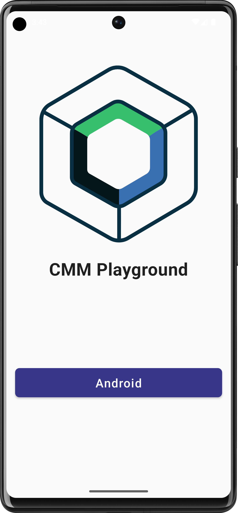
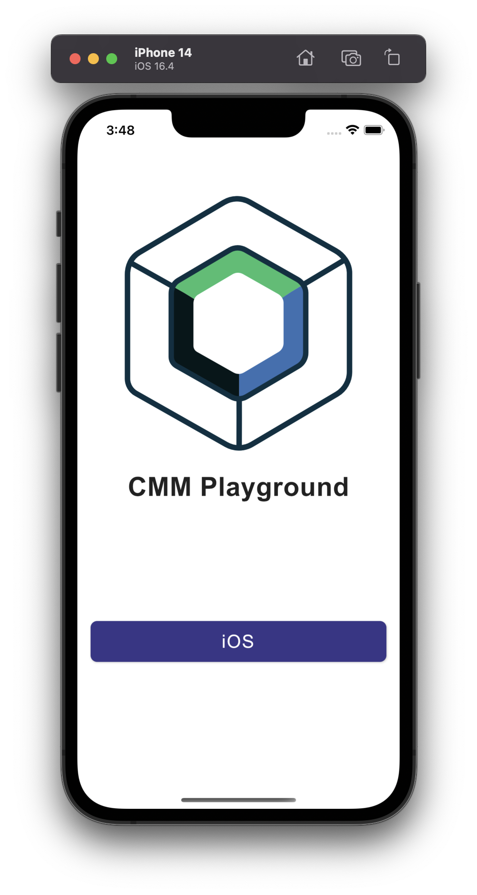
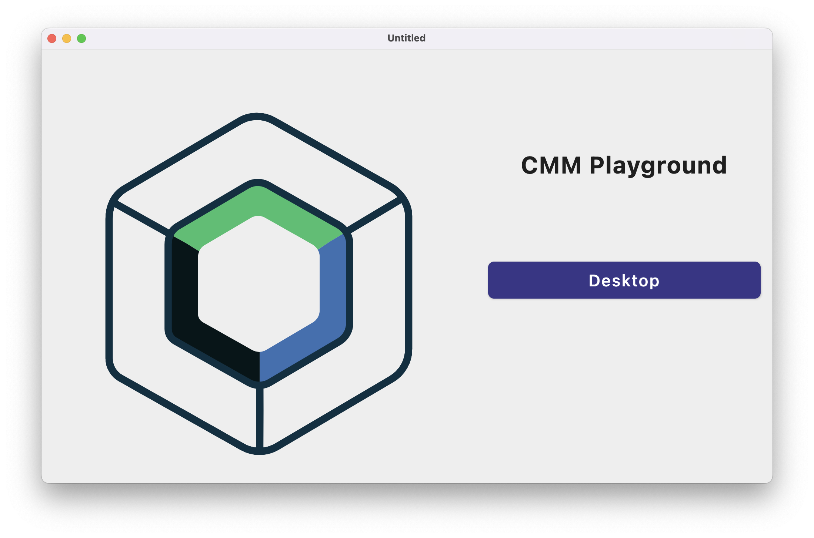
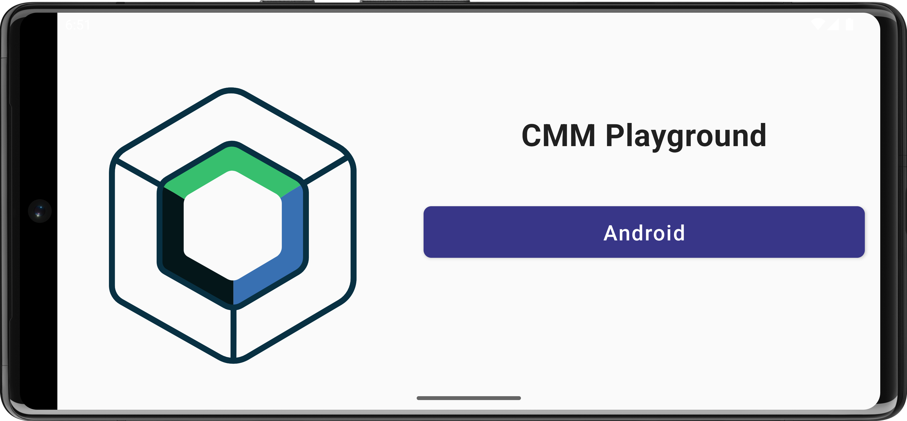
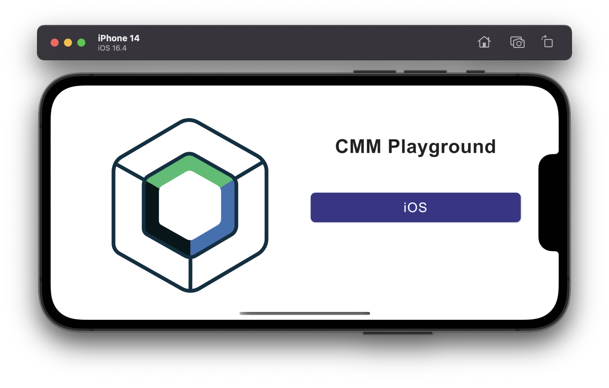

# CMM-Playground
[](https://opensource.org/licenses/Apache-2.0)

A [compose multiplatform](https://www.jetbrains.com/lp/compose-multiplatform/) project showcasing sharing of ui code between android, ios and desktop platforms. The screens are fully responsive to all screensizes across all platforms. You can use this template as your starter pack for your compose multiplatform project


## **Screenshots 📷**
| | | |
|:-------------------------:|:-------------------------:|:-------------------------:|
| Android  | IOS  | Desktop  |

| | |
|:-------------------------:|:-------------------------:|
| Android   | IOS  |

## Project structure

### Modules

### 1.shared

This is a Kotlin module that contains the logic common for both Android and iOS applications, that is, the code you share between platforms.

This `shared` module is also where you’ll write your Compose Multiplatform code.
In `shared/src/commonMain/kotlin/App.kt`, you can find the shared root `@Composable` function for your app.

It uses Gradle as the build system. You can add dependencies and change settings in `shared/build.gradle.kts`.
The `shared` module builds into an Android library and an iOS framework.

### 2.androidApp

This is a Kotlin module that builds into an Android application. It uses Gradle as the build system.
The `androidApp` module depends on and uses the `shared` module as a regular Android library.

### 3.iosApp

This is an Xcode project that builds into an iOS application.
It depends on and uses the `shared` module as a CocoaPods dependency.

### 4.desktopApp

This is a Kotlin module that builds into a desktop application. It uses Gradle as the build system. The `desktopApp`
module depends on and uses the `shared` module as a regular library.

  ## License and Copyright ©️
  
  ```
    Copyright 2023 Felix Kariuki

    Licensed under the Apache License, Version 2.0 (the "License");
    you may not use this file except in compliance with the License.
    You may obtain a copy of the License at

       http://www.apache.org/licenses/LICENSE-2.0

    Unless required by applicable law or agreed to in writing, software
    distributed under the License is distributed on an "AS IS" BASIS,
    WITHOUT WARRANTIES OR CONDITIONS OF ANY KIND, either express or implied.
    See the License for the specific language governing permissions and
    limitations under the License.
  
  ```
